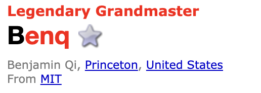
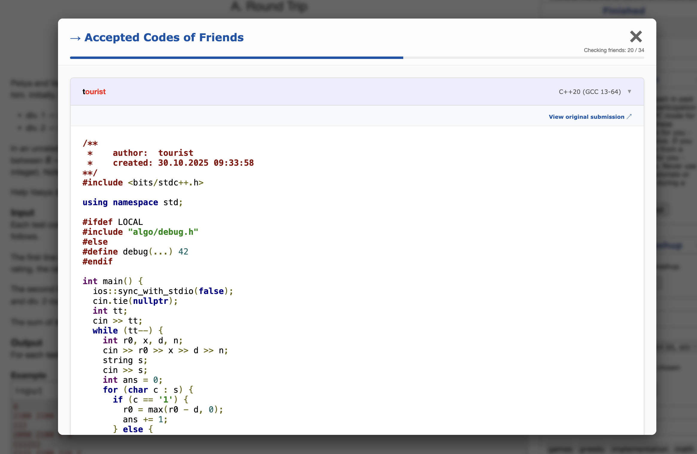
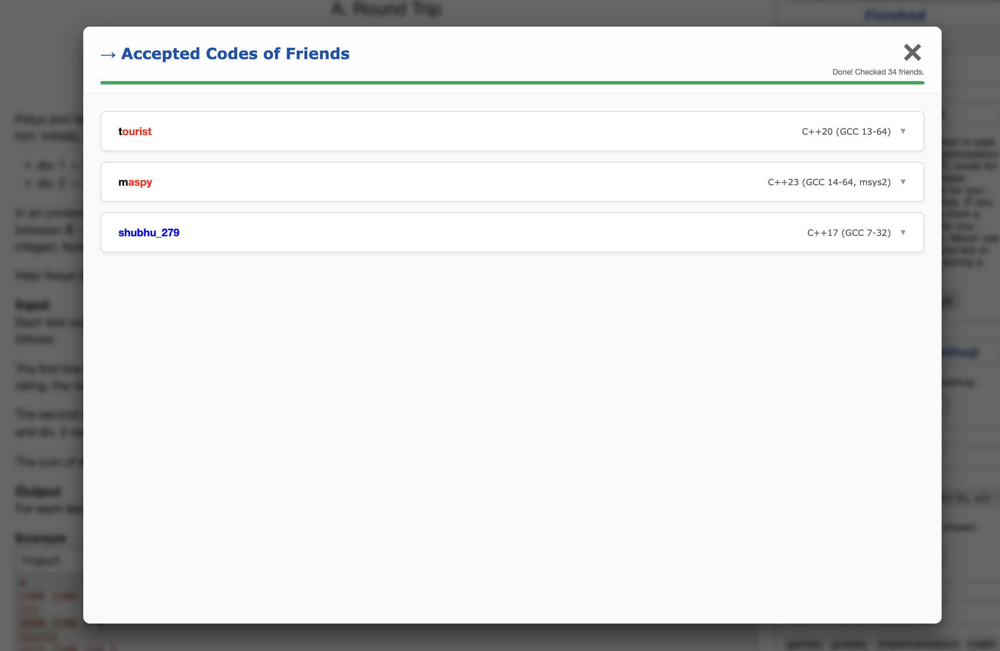

# CF FetchCodes

> View your Codeforces friends' accepted solutions + AI-powered code explanations — right on the problem page.

---

## What It Does

Stuck on a Codeforces problem? Wondering how your friends solved it?

**CF FetchCodes** adds a sidebar widget on every problem page that lets you:

- 📋 **See which friends solved the problem** — auto-detected from your CF friends list
- 💻 **Read their code** with syntax highlighting — right on the page, no navigation needed
- 🤖 **Ask AI to explain any solution** — built-in Gemini-powered chat explainer
- ✂️ **Explain selected code snippets** — right-click any selected text on Codeforces
- 🌙 **Dark mode** — full page dark mode + selectable code syntax themes

---

## Installation

### From Chrome Web Store (Recommended)

1. Visit the [Chrome Web Store listing](https://chromewebstore.google.com/detail/cf-fetchcodes/ombmefkchmjbodcoboeagbpaejfojnga)
2. Click **"Add to Chrome"** → **"Add extension"**
3. Done! The extension icon appears in your toolbar

### From Source (Developer)

1. Clone this repository
2. Open `chrome://extensions` → enable **Developer mode**
3. Click **Load unpacked** → select this project folder
4. Navigate to any Codeforces problem page

---

## How to Use

### 1. Add Friends on Codeforces

The extension uses your Codeforces friends list. If you haven't added friends yet:

1. Go to any user's profile on Codeforces
2. Click the **⭐ Star** button next to their handle

### 2. View Friends' Solutions

1. Open any problem page (e.g., `codeforces.com/contest/1234/problem/A`)
2. Find **"→ Accepted Codes of Friends"** in the right sidebar
3. Click **"Show Codes"**

4. The extension checks your friends and shows who solved it
5. Click any friend's name to expand and view their code

### 3. AI Code Explainer

Click the **🤖 Explain** button above any friend's code to open an AI chat that:
- Analyzes the solution approach
- Explains the time/space complexity
- Answers follow-up questions

**Setup required:** Click the extension icon in the toolbar and paste your [Gemini API key](https://aistudio.google.com/app/apikey).

### 4. Right-Click Snippet Explain

Select any text on a Codeforces page → right-click → **"Explain code with AI"** to get an instant explanation.

---

## AI Settings

Click the extension icon in the toolbar to configure:

| Setting | Description | Default |
|---------|-------------|---------|
| 🔑 **Gemini API Key** | Your Google AI Studio API key | *(required)* |
| 🤖 **AI Model** | Gemini model name | `gemini-2.5-flash` |
| 📝 **Full Code Prompt** | System prompt for full code explanations | Analyze approach + complexity |
| ✂️ **Snippet Prompt** | System prompt for right-click snippet explanations | Explain logic + syntax |
| 🌙 **Page Dark Mode** | Dark mode for the entire Codeforces page | Off |
| 🎨 **Code Dark Mode** | Dark mode for code blocks + syntax theme | Off / Monokai |

---

## Privacy & Safety

- **No external servers** — all processing happens locally in your browser
- **Anti-ban architecture** — human-like delays and smart batching prevent rate-limiting
- **Two-phase discovery** — uses `contest.standings` API for bulk checking, minimizing API calls
- **API key stored locally** — your Gemini key is saved in `chrome.storage.local`, never transmitted anywhere except Google's Gemini API
- **Minimal permissions** — only `storage` is required on install. The `contextMenus` permission (for right-click explain) is requested only when you enable AI features

---

## Prerequisites

- Google Chrome (or any Chromium-based browser)
- A Codeforces account with friends added
- *(Optional)* A [Gemini API key](https://aistudio.google.com/app/apikey) for AI features

---

## Release Notes

### v26.7.27 (Latest)
- **Optional Permissions** — `contextMenus` is now optional; requested only when you save an API key. No more scary "new permissions" prompt on update
- **Trust Disclaimer** — API key field now shows "Stored locally only — never sent to our servers"

### v26.7.23
- **Dark Mode** — full page dark mode + code-only dark mode with 6 syntax themes (Monokai, Dracula, Solarized Dark, Nord, GitHub Dark, One Dark)
- **Modern Popup** — redesigned settings popup with toggle switches

### v26.7.9
- **Two-Phase Discovery** — uses `contest.standings` for instant friend checking (10x faster)
- **AI Code Explainer** — built-in Gemini chat for understanding solutions
- **Right-Click Explain** — select code → right-click → explain with AI
- **Modular Architecture** — codebase split into focused modules under `src/`
- **Toast Notifications** — non-intrusive feedback replaces browser alerts
- **Auto-Growing Chat Input** — textarea that expands as you type, Shift+Enter for newlines

### v25.11.21
- New accordion UI with scrollable list
- Smart caching — re-opening code is instant
- Progress bar for friend checking status
- Safety-first batching system

### v0.1.0
- Syntax highlighting for friend solutions
- Navigation links to profiles and submissions

---
### ⚠️ DISCLAIMER: 
- DO NOT use this extension during live Codeforces rounds.
- CF FetchCodes is built strictly for UPSOLVING and PRACTICE after a contest is completely finished.
- Using AI or any external code during a live, rated round is strictly prohibited by Codeforces and ruins the platform for everyone.
- Use this tool to learn, improve your logic, and get unstuck during practice..not to cheat your rating. 

### 📚 Read the Official Codeforces Stance on AI & Cheating:
- Mike's Blog on AI Rules: [https://codeforces.com/blog/entry/133941](https://codeforces.com/blog/entry/133941)(The official announcement banning ChatGPT, Copilot, and AI tools during live rounds)
- General Codeforces Rules: [https://codeforces.com/blog/entry/4088](https://codeforces.com/blog/entry/4088)
---
## Contributing

Issues, feature requests, and pull requests are welcome at the [GitHub repository](https://github.com/sayanpaulcse/CF_FetchCodes).

## Contact

📧 [sayanpauldeveloper@gmail.com](mailto:sayanpauldeveloper@gmail.com)

---

**Happy upsolving!** 🚀
